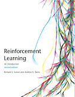

# RL Book Companion



This repository contains study notes, exercise solutions, and experiment notebooks created while studying *Reinforcement Learning: An Introduction (2nd Edition)* by Richard S. Sutton and Andrew G. Barto.

For more information about the book, see the [official book page](http://incompleteideas.net/book/the-book-2nd.html).

## Contents

- Chapter-based study notes
- Chapter-based exercise solutions
- Jupyter notebooks for reproducing examples from the book
- Code for generating selected figures

At the moment, the repository includes material for Chapters 1 through 3, with more chapters to be added over time.

## Directory Structure

```text
.
├── compose.yaml
├── ch01/
│   ├── notes.md
│   └── solutions.md
├── ch02/
│   ├── figures.ipynb
│   ├── notes.md
│   └── solutions.ipynb
├── ch03/
│   ├── notes.md
│   └── solutions.md
└── img/
    └── smallbookcover.gif
```

## Running the Notebooks

This repository is set up to run with `docker compose` using the `quay.io/jupyter/datascience-notebook` image.

### 1. Start Jupyter Lab

From the repository root, start the notebook container:

```bash
docker compose up
```

This publishes Jupyter Lab on `http://localhost:8888` by default. You can override the port and token with environment variables:

```bash
JUPYTER_PORT=8889 JUPYTER_TOKEN=rlbook docker compose up
```

To stop the environment:

```bash
docker compose down
```

## Files

- `ch01/notes.md`: study notes for Chapter 1
- `ch01/solutions.md`: exercise solutions for Chapter 1
- `ch02/notes.md`: study notes for Chapter 2
- `ch02/solutions.ipynb`: exercise solutions notebook for Chapter 2
- `ch02/figures.ipynb`: experiments and figure reproduction for Chapter 2
- `ch03/notes.md`: study notes for Chapter 3
- `ch03/solutions.md`: exercise solutions for Chapter 3
- `compose.yaml`: Docker Compose configuration for the notebook environment

## Development Notes

This repository includes a pre-commit configuration and currently uses the `nbdev_clean` hook. If you edit notebooks, it is a good idea to install the hook before committing.

```bash
pre-commit install
```

## License

This repository uses separate licenses for different kinds of material. See [LICENSE](LICENSE) for the full notice and [LICENSES](LICENSES) for the license texts.

- Original code, notebooks, scripts, and configuration files are licensed under the [MIT License](LICENSES/MIT.txt).
- Original study notes, explanations, and solution write-ups are licensed under the [Creative Commons Attribution-NonCommercial-ShareAlike 4.0 International License](LICENSES/CC-BY-NC-SA-4.0.txt) (CC BY-NC-SA 4.0).
- Exercise statements from the book, the book cover image, figures from the book, and any other third-party material are not covered by the licenses above and remain the property of their respective copyright holders.

This project references and studies material from *Reinforcement Learning: An Introduction (2nd Edition)* by Richard S. Sutton and Andrew G. Barto. Problem statements are identified by exercise number and are not reproduced here except, where necessary, in limited and attributed form.

The original book is distributed separately by its authors and publisher. This repository does not grant permission to reproduce, redistribute, or create derivative works from the book or other third-party material.

## Notes

- The solutions and implementations are written for personal study.
- They are not official answers, but notes and experimental results collected during the learning process.
